# `Dockerized` Ensemble Framework For Flash Flood Forecasting (EF5)  

*Containerized* (Docker) version of **[EF5](https://github.com/HyDROSLab/EF5)**, which enables users to easily build, configure and run EF5 on their local machines.

# Table of Contents 

## General Information

This project builds a single, minimal, Docker Linux image based on [Alpine Linux 3.17](https://hub.docker.com/_/alpine). When the image is built, it will install the needed dependencies to build EF5, then proceed to clone EF5's source code from the main [EF5 repository from GitHub](https://github.com/HyDROSLab/EF5), and finally it will compile the EF5 executable.  
The EF5 installation will be placed in the path `/ef5` **WITHIN THE RUNNING CONTAINER** (*i.e. not directly accessible to the host machine*). It will also define the following *volumes* (_folders_) **WITHIN THE RUNNING CONTAINER**: `/conf`, `/data`, `/results`. These will serve as communication points (_mount points_) between the container and the host machine (the user's computer), to provide inputs to EF5 (parameters, data, and states), and to receive results (model outputs, and state outputs) from EF5's execution.

When this image is used to run a container, it will mount the following project folders, and make them available to the running image:
- **[./conf](./conf)** [RO]: where the running EF5 instance will look for a control file named [control.txt](./conf/control.txt) (*the control file __MUST__ be named `control.txt` for the default container configuration to work*). Further information regarding control files can be found in the [EF5 manual](./docs/manual.html). `This project folder will be mounted on the container using read-only permissions, since EF5 only needs to read the control file.`
- **[./data](./data)** [RW]: where the running EF5 instance will look for data such as flow accumulation grids, digital elevation data, flow direction grids, kinematic wave parameter maps, and precipitation data. `This project folder will be mounted on the container using read-write permissions, since EF5 must be able to write outputs to the /data/states folder`
- **[./results](./results/)** [RW]: where the running EF5 instance will write model results and state outputs, so that the user can retain a copy of these results on the host machine once the container finishes running EF5. `This project folder will be mounted on the container using read-write permissions, since EF5 must be able to write outputs to this folder.`

# Docker

>*Docker is a software platform that allows you to build, test, and deploy applications quickly. Docker packages software into standardized units called containers that have everything the software needs to run including libraries, system tools, code, and runtime. Using Docker, you can quickly deploy and scale applications into any environment and know your code will run.*  ([Amazon AWS](https://aws.amazon.com/docker/))

Docker is required to build and deploy this version of EF5. You will need to install either Docker Desktop or Docker Engine, depending on the Operating System you are using.

>Even though [Docker Desktop has bee released for Linux](https://docs.docker.com/desktop/install/linux-install/), the present project **HAS NOT BEEN TESTED** using this kind of Docker installation. **If you are using Linux, please make sure to install and use the [Docker Engine](#docker-engine)**.

## Installing Docker

Please follow the [official Docker documentation](https://docs.docker.com/get-docker/) in order to install Docker on your system before proceeding any further.

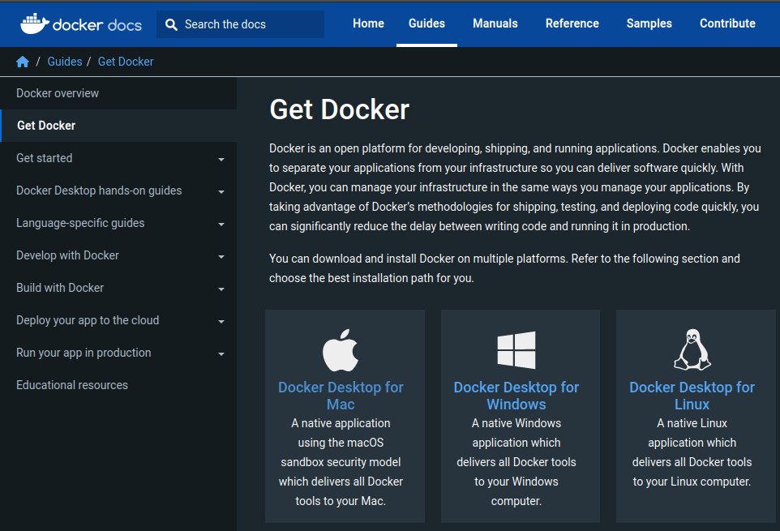  
*Official Docker Documentation Page*

> **NOTE:** If you are running MacOS, please note that there are **TWO DIFFERENT VERSIONS** of Docker Desktop: one for `Intel-based Macs`, and other for `Apple Silicon-based Macs` (*i.e.* Macs with M1 or M2 processors). Please choose the one which matches your machine's processor type.
>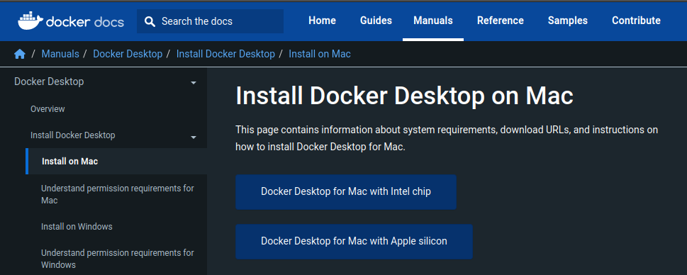  
*Docker Documentation - Mac Intel Chip or Apple Silicon*

### Docker Desktop
- [Windows](https://docs.docker.com/desktop/install/windows-install/)
- [Mac](https://docs.docker.com/desktop/install/mac-install/)

### Docker Engine
- [Linux](https://docs.docker.com/engine/install/)

>If you have any troubles installing Docker on you machine, please refer to the Official Docker documentation, or to the [Troubleshooting](#troubleshooting) section at the end of this Readme file.

# Dockerized EF5

Having installed either [Docker Desktop](https://docs.docker.com/desktop/) or [Docker Engine](https://docs.docker.com/engine/) on your system, you can proceed to build and execute the EF5 *container* on your local machine. 

## Download this repository

### GIT

If you are familiar with `git` and `github` repositories, please `clone` this repository on your local machine. If not, please follow the [instructions below](#download-a-zip-file) to download this repository as a `ZIP` file.

### Download a ZIP file

On the top part of this Github repository page, you will find a green `code` button. Click on it to display a new pane with options, and subsequently, click on the `Download Zip` button, at the bottom of the pane that opens. 

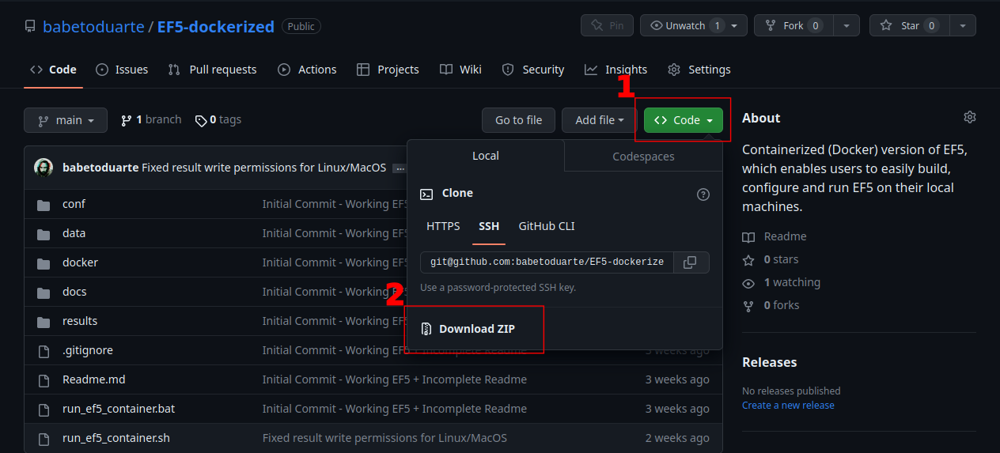  
*Downloading or Cloning the EF5-dockerized repository*

This will prompt your web browser to download a `.zip` file with the contents of this repository. Please save it in a place you can find easily for the following steps.

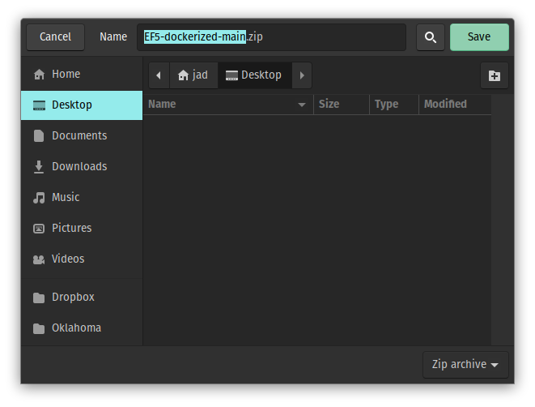  
*Downloading the EF5-dockerized Zip file*

>Note: your browser might have not have prompted you for a location where to save the file, and most likely you'll find it in your `Desktop` folder in your "home directory".

To continue, please follow the instructions below, according to the Operating System you are running. Currently supported platforms are [Linux](#linux), [Windows](#windows) and [MacOS](#macos).

## Windows

Once Docker Desktop is installed, you will be requested to accept the `Docker Subscription Service Agreement`.

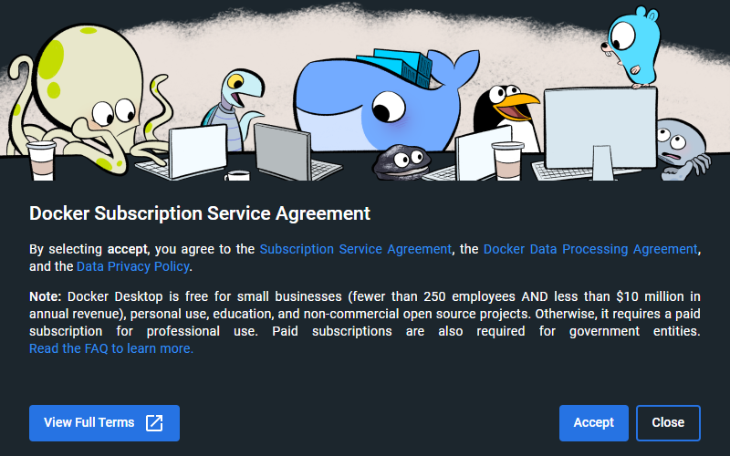  
*Docker Desktop - Accept the Service Agreement*

Note that **if you do not accept these terms, you will not be able to use Docker Desktop**. Since you are likely using Docker Desktop for personal use, you won't need to pay for a Docker license.

>**NOTE:**If after accepting the service agreement terms you are presented with a **WSL Error Window**, please see the [Troubleshooting Section](#windows-subsystem-for-linux-wsl-error) at the end of this document.

After accepting the license terms, your Docker Desktop window will inform you that the Docker Engine is being started:

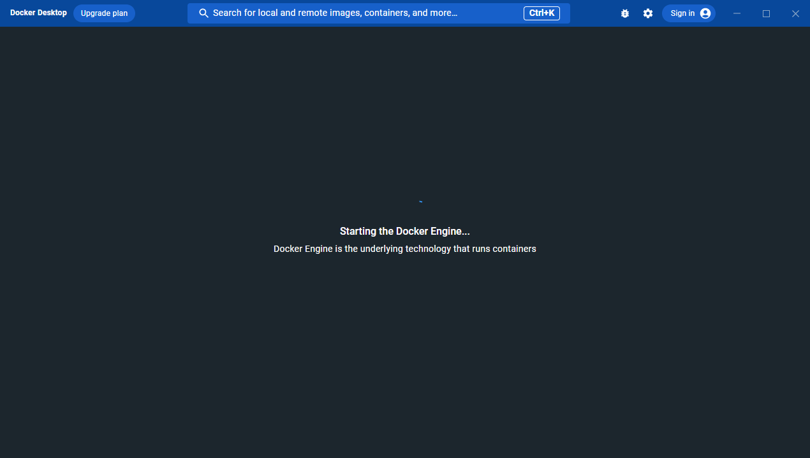
*Docker Desktop - Starting Docker Engine*

Once the Engine has been started, you will see the default Docker Desktop interface, without any configured containers, images or volumes:

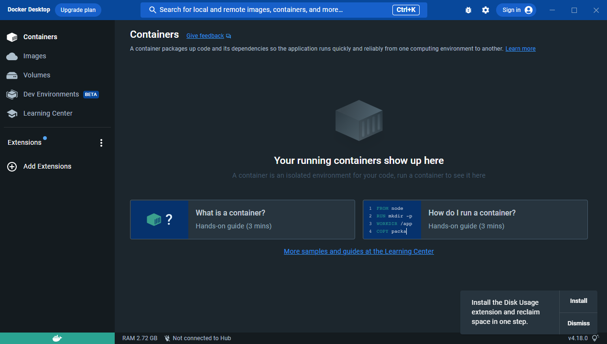
*Docker Desktop - Up and Running*

At this point, you have successfully managed to install Docker Desktop on your system, and now can proceed to [build the EF5 container](#building-the-ef5-container-image). Once the container's image has been built, you can proceed to [run the EF5 container](#running-the-ef5-container-image).

> **NOTE**: you should keep in mind that by *just* running the EF5 container, without having customized your *configuration file*, and added some *data*, your model's execution won't produce any relevant *outputs*. Refer to the [EF5 manual](./docs/manual.html) for further information.

### Building the EF5 container image

Before running the EF5 container, **its Docker image must be _built_**. Through this process, which is defined in the project's [Dockerfile](./docker/Dockerfile), the Docker Engine will:

1. Download a [base Linux image](https://hub.docker.com/_/alpine) from [DockerHub](https://hub.docker.com/)
2. Mount the following project folders so that our container can read and write data to and from the host machine:
    - `.\conf` -> `/conf`
    - `.\data` -> `/data`
    - `.\results` -> `/results`
3. Update the software repositories on the container, and install the following packages:
    - software building tools: `git`, `automake`, `autoconf`, and `build-base`
    - EF5 dependencies like `libgeotiff-dev`
4. Compile and install EF5 on the container using the `autoreconf` and `make` commands.

#### **USING THE [build_ef5_container.bat](./docker/build_ef5_container.bat) SCRIPT**

To build the EF5 container, use your file explorer to navigate to the project's main folder. Once there, navigate into the `docker/` folder; here you will find the following three files:

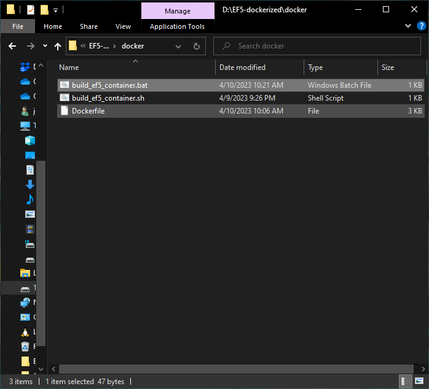
*Windows Explorer - .\docker/ directory*

>**NOTE**: Note that there are two different build scripts: a *BASH script* (ending in `.sh`, meant to be used on Linux and MacOS systems), and a a *BATCH script* (ending in `.bat`, meant to be used on Windows systems)

Double click on the *BATCH FILE* named [build_ef5_container.bat](./docker/build_ef5_container.bat) to start the build process. A command line window will open, and you will see some output showing the process as Docker builds the image:

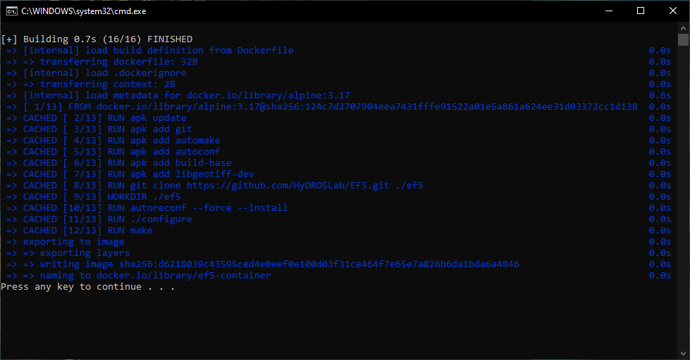
*Command Line - Docker Build*

Assuming no errors are shown on the terminal window, and you see a prompt to *press any key*, the EF5 container image should have been built successfully. You can press any key, which will close the command line window once the building process is done.

You can verify that the `ef5-container` image has been built, by checking on the `Images` pane in your Docker Desktop main window:

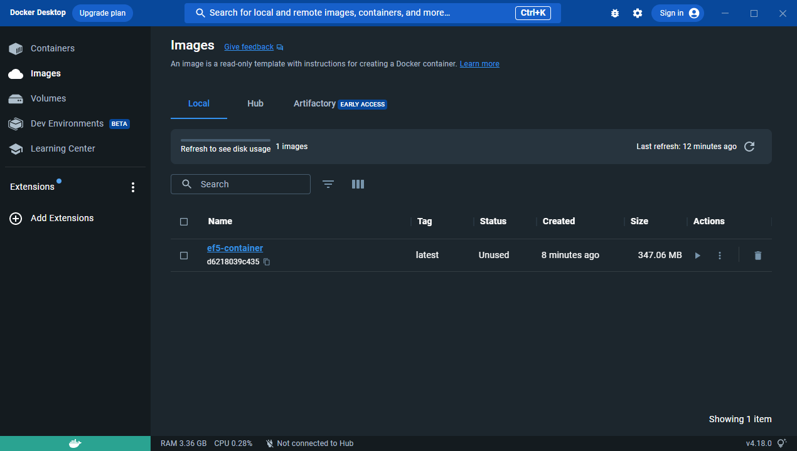
*Docker Desktop - Images*

At this point, the EF5 Docker image has been build, and it is ready to be executed.

### Running the EF5 container image

After [building the EF5 container image](#building-the-ef5-container-image), and assuming that:

- you have valid input data and states in your `.\data\` folder, and
- you have a valid EF5 configuration file in you `.\conf\` folder, **named** `control.txt`,

you should be able to use the script `.\run_ef5_container.bat` to execute your EF5 model simulation.

#### **USING THE [run_ef5_container.bat](./run_ef5_container.bat) SCRIPT**

To run the EF5 container, use your file explorer to navigate to the project's main folder. Once there, locate the [run_ef5_container.bat](./run_ef5_container.bat) script:

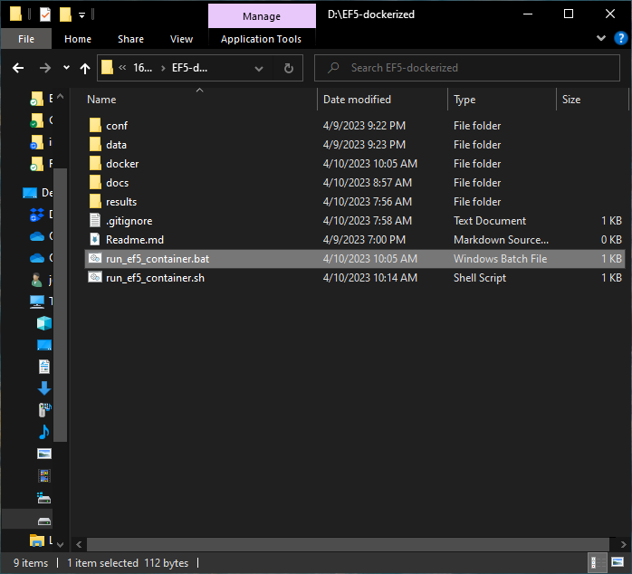
**Windows Explorer - Project directory

>**NOTE**: Note that there are two different run scripts: a *BASH script* (ending in `.sh`, meant to be used on Linux and MacOS systems), and a a *BATCH script* (ending in `.bat`, meant to be used on Windows systems)

Double click on the *BATCH FILE* named [run_ef5_container.bat](./run_ef5_container.bat) to start the execution process. A command line window will open, and you will see some output showing the process as EF5 is being executed with your control file, parameters, data, and states:

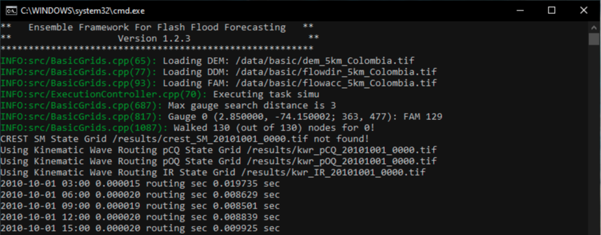
*Command Line - EF5 Execution*

Once the EF5 execution is done, you will see the output cease to appear on the command line window, and you will be prompted to to *press any key*. You can press any key, which will close the command line window once the building process is done:

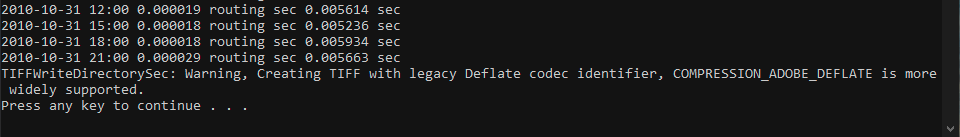
*Command Line - EF5 Done*

You can locate the resulting outputs from your EF5 execution under the [.\results\](./results/) folder in the project's main directory:

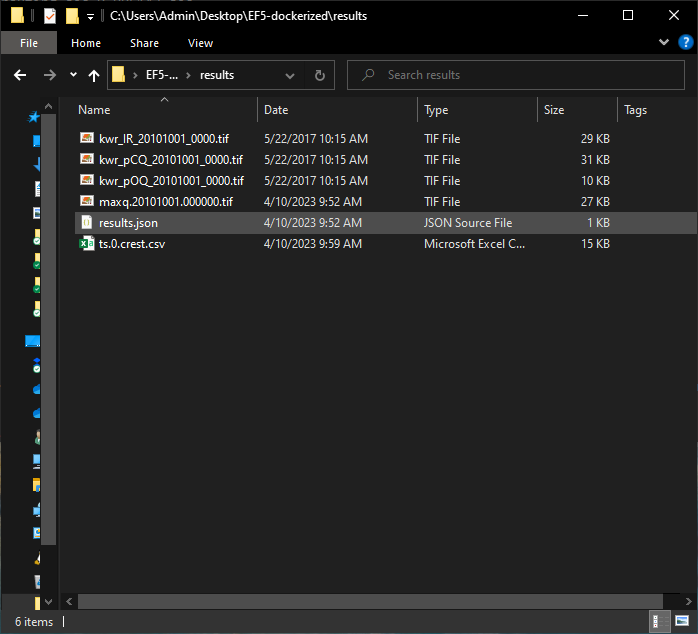
*Windows Explorer - Results outputs*

>**NOTE**: If you configured your EF5 control file to produce `states`, these files will be saved in the following sub-directory [.\data\states\](./data/states/).

After you have executed the EF5 Docker container, you will notice that your Docker Desktop window will show a container that was built and ran (with an arbitrary name) within the `Containers` pane:

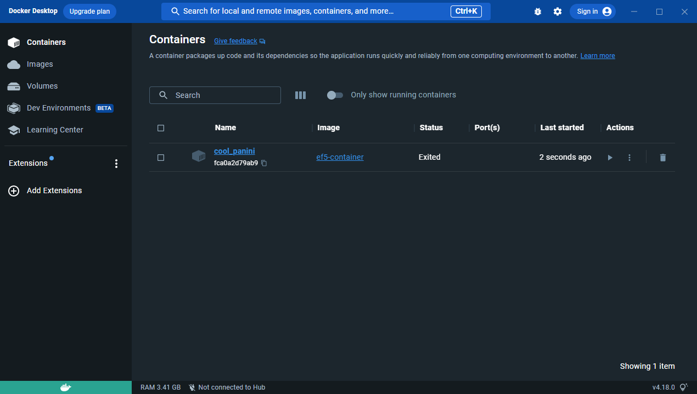
*Docker Desktop - Containers*

Note that multiple executions may produce multiple `container` items in your Docker Desktop window. You can delete these as you perform new executions of your simulations:

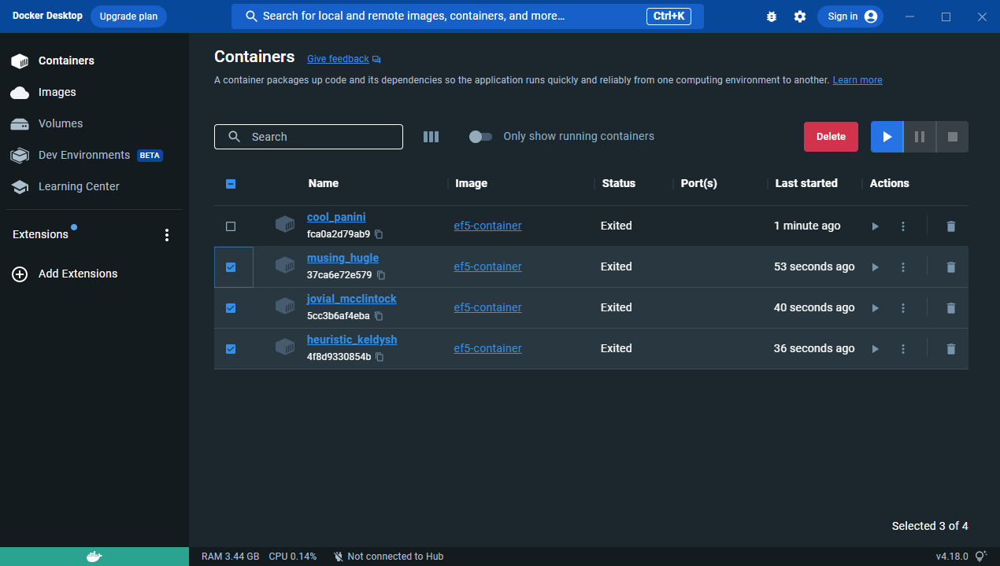
*Docker Desktop - Multiple Containers*

## MacOS

Once Docker Desktop is installed, you will be requested to accept the `Docker Subscription Service Agreement`.

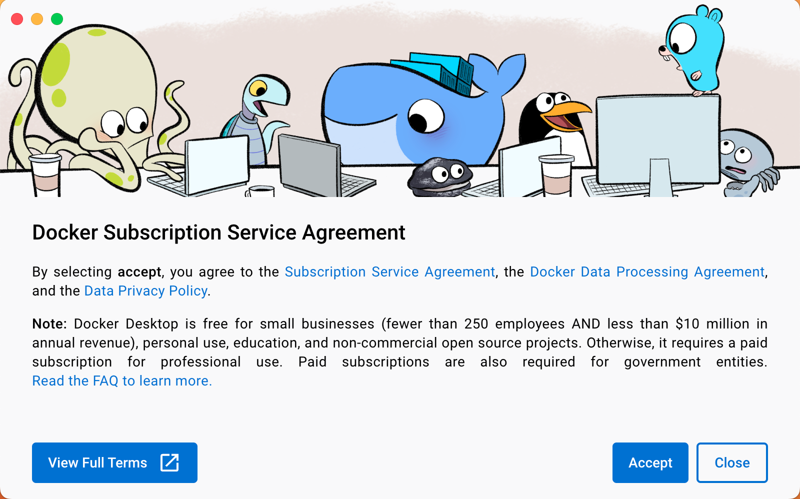  
*Docker Desktop - Accept the Service Agreement*

Note that **if you do not accept these terms, you will not be able to use Docker Desktop**. Since you are likely using Docker Desktop for personal use, you won't need to pay for a Docker license. After accepting the license terms, your Docker Desktop window will ask you to *complete the installation*, where you can select to use the `recommended settings`:

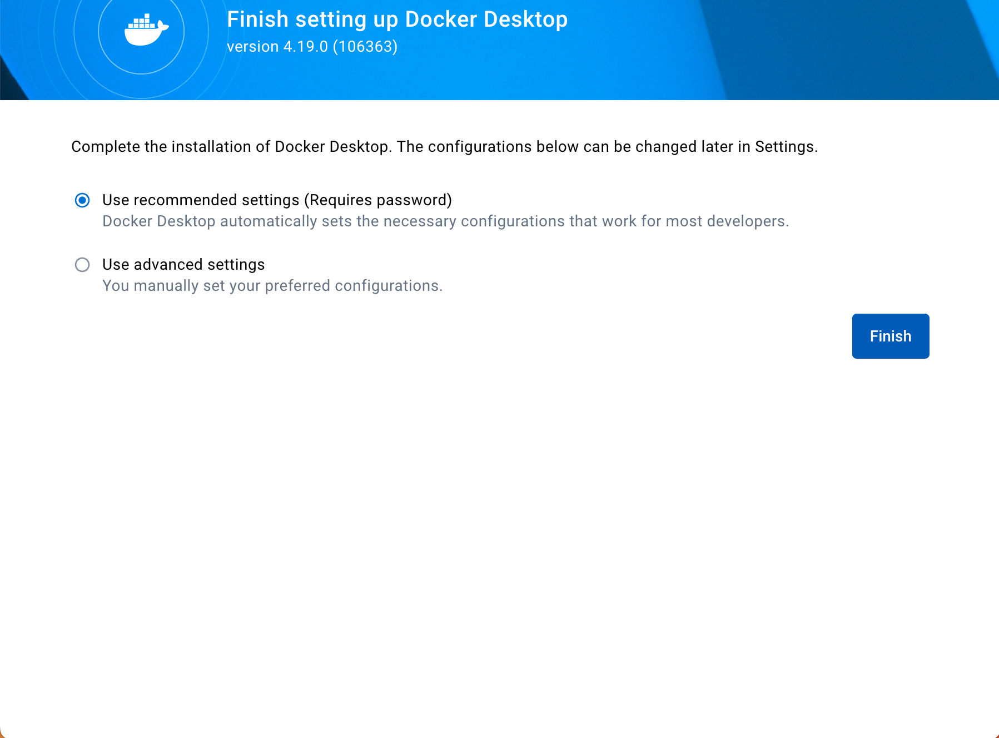
*Docker Desktop - Setup*

Then, you may be asked to complete a small survey indicating the type of role you play, and your intended use for Docker. You can submit this information or skip this step:


*Docker Desktop - Role*

Once you have completed the previous steps, you will see the default Docker Desktop interface, without any configured containers, images or volumes:


*Docker Desktop - Up and Running*

At this point, you have successfully managed to install Docker Desktop on your system, and now can proceed to [build the EF5 container](#building-the-ef5-container-image-1). Once the container's image has been built, you can proceed to [run the EF5 container](#running-the-ef5-container-image-1).

> **NOTE**: you should keep in mind that by *just* running the EF5 container, without having customized your *configuration file*, and added some *data*, your model's execution won't produce any relevant *outputs*. Refer to the [EF5 manual](./docs/manual.html) for further information.

### Building the EF5 container image

Before running the EF5 container, **its Docker image must be _built_**. Through this process, which is defined in the project's [Dockerfile](./docker/Dockerfile), the Docker Engine will:

1. Download a [base Linux image](https://hub.docker.com/_/alpine) from [DockerHub](https://hub.docker.com/)
2. Mount the following project folders so that our container can read and write data to and from the host machine:
    - `./conf` -> `/conf`
    - `./data` -> `/data`
    - `./results` -> `/results`
3. Update the software repositories on the container, and install the following packages:
    - software building tools: `git`, `automake`, `autoconf`, and `build-base`
    - EF5 dependencies like `libgeotiff-dev`
4. Compile and install EF5 on the container using the `autoreconf` and `make` commands.

#### **USING THE [build_ef5_container.sh](./docker/build_ef5_container.sh) SCRIPT**

To build the EF5 container, use your **Terminal** to navigate to the project's main folder. The following code example assumes the project's folder will be located on your `~/Desktop/` folder, within your home directory:

``` bash
[~]$> cd ~/Desktop/ef5-dockerized-main/
[ef5-dockerized]$>
```

Once there, navigate into the `docker/` folder:

``` bash
[ef5-dockerized]$> cd docker
[ef5-dockerized/docker]$>
```

>**NOTE**: Note that there are two different build scripts: a *BASH script* (ending in `.sh`, meant to be used on Linux and MacOS systems), and a a *BATCH script* (ending in `.bat`, meant to be used on Windows systems)

Once there, execute the *BASH FILE* named [build_ef5_container.sh](./docker/build_ef5_container.sh) to start the build process:

``` bash
[ef5-dockerized/docker]$> bash build_ef5_container.sh
```

Once the process starts, you will see some output showing the process as Docker builds the image:


*Command Line - Docker Build*

Assuming no errors are shown on the terminal window, and you see a prompt to *press any key*, the EF5 container image should have been built successfully. You can press any key, which will close the command line window once the building process is done.

You can verify that the `ef5-container` image has been built, by checking on the `Images` pane in your Docker Desktop main window:


*Docker Desktop - Images*

At this point, the EF5 Docker image has been build, and it is ready to be executed.

### Running the EF5 container image

After [building the EF5 container image](#building-the-ef5-container-image-1), and assuming that:

- you have valid input data and states in your `./data/` folder, and
- you have a valid EF5 configuration file in you `./conf/` folder, **named** `control.txt`,

you should be able to use the script `./run_ef5_container.sh` to execute your EF5 model simulation.

#### **USING THE [run_ef5_container.sh](./run_ef5_container.sh) SCRIPT**

To run the EF5 container, use your **Terminal** to navigate to the project's main folder. The following code example assumes the project's folder will be located on your `~/Desktop/` folder, within your home directory:

``` bash
[~]$> cd ~/Desktop/ef5-dockerized-main/
[ef5-dockerized]$>
```

>**NOTE**: Note that there are two different run scripts: a *BASH script* (ending in `.sh`, meant to be used on Linux and MacOS systems), and a a *BATCH script* (ending in `.bat`, meant to be used on Windows systems)

Once there, execute the *BASH FILE* named [run_ef5_container.sh](./docker/build_ef5_container.sh) to start the execution of the container:

``` bash
[ef5-dockerized]$> bash run_ef5_container.sh
```

Once the process starts, you will see some output showing the process as Docker runs the container.

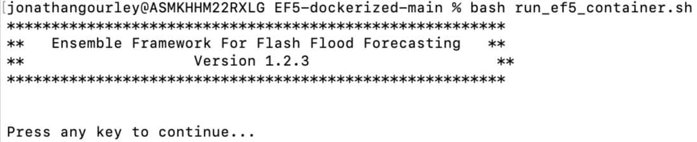
*Command Line - Docker Run*

You will see some output showing the process as EF5 is being executed with your control file, parameters, data, and states:

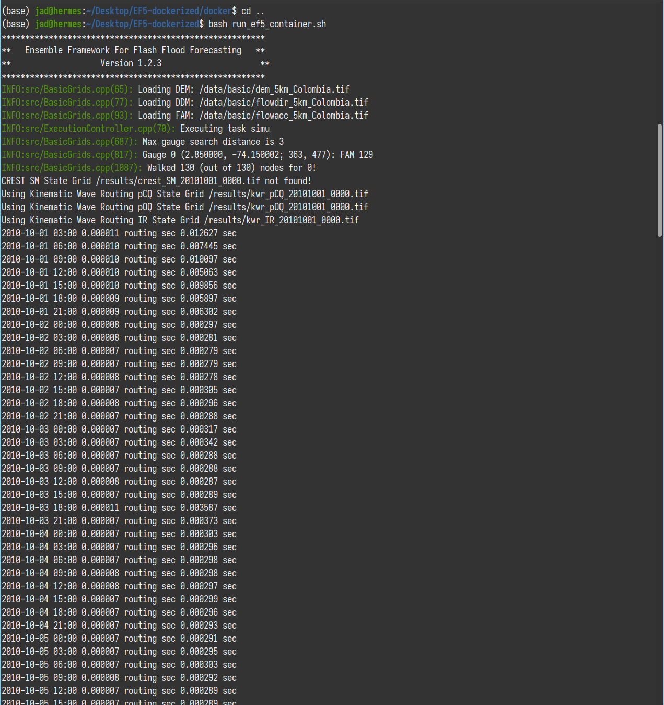
*Command Line - EF5 Execution*

Once the EF5 execution is done, you will see the output cease to appear on the command line window:

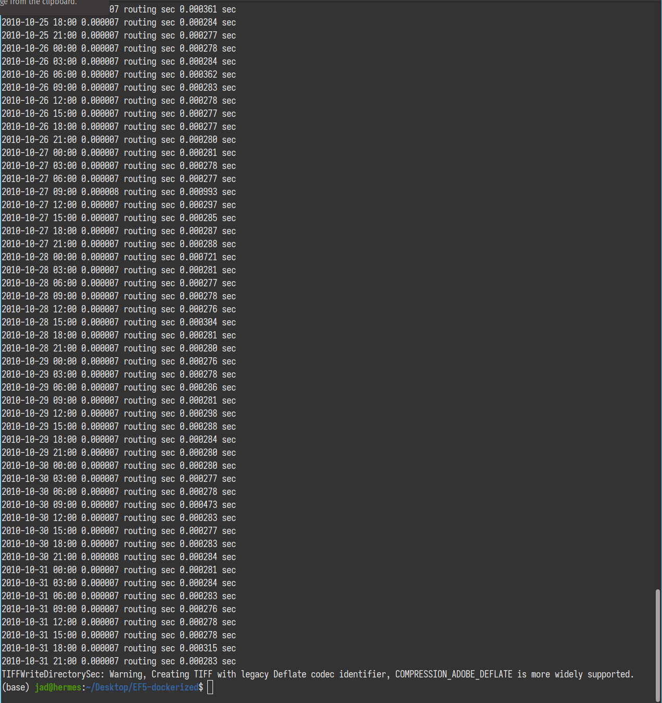
*Command Line - EF5 Done*

You can locate the resulting outputs from your EF5 execution under the [./results/](./results/) folder in the project's main directory:

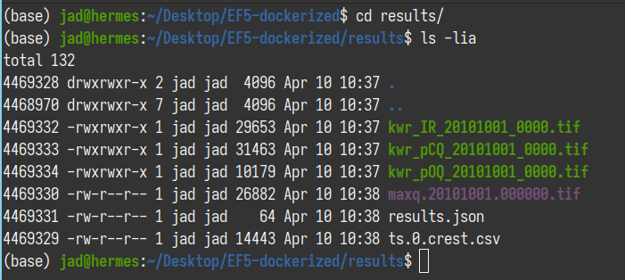
*Command Line - Results*

>**NOTE**: If you configured your EF5 control file to produce `states`, these files will be saved in the following sub-directory [./data/states/](./data/states/).

After you have executed the EF5 Docker container, you will notice that your Docker Desktop window will show a container that was built and ran (with an arbitrary name) within the `Containers` pane:


**

Note that multiple executions may produce multiple `container` items in your Docker Desktop window. You can delete these as you perform new executions of your simulations:


*Docker Desktop - Multiple Containers*

## Linux

### Building the EF5 container image

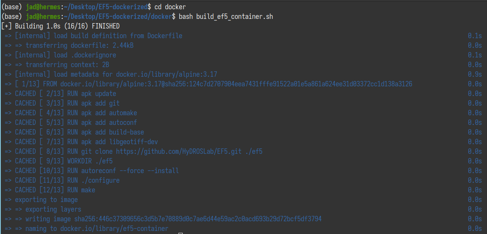  
*Building the EF5 Docker Image under Linux*

### Running the EF5 container image

  
*Running the EF5 container under Linux #1*

  
*Running the EF5 container under Linux*

  
*Results of EF5 execution under Linux*

# Troubleshooting
## Docker Installation Troubleshooting
In this section you will find solutions to common issues when installing Docker. Please not that this is not a comprehensive list, and only documents the troubles that the developers might have encountered while developing the documentation for this containerized application.

## Windows Installation

When you download the Docker Desktop installer executable on your machine (`Docker Desktop Installer.exe`), double-click it to launch the installation process. Windows will likely prompt you with a `Security Warning`, asking you to confirm whether you want to proceed with the installation:

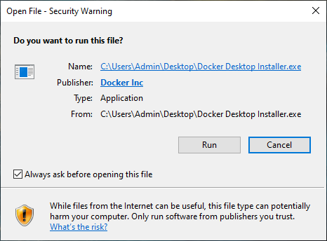  
*Docker Desktop Installation - Windows Security*

Please click on the `Run` button to continue with the installation. On the next screen, it is recommended to use the [Windows Subsystem for Linux](#windows-subsystem-for-linux-wsl-error), following the official installation documentation.

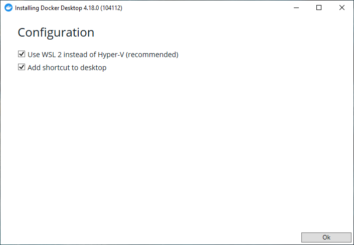  
*Docker Desktop Installation - 1*

The installation will then take place, please be patient while Docker Desktop is installed.

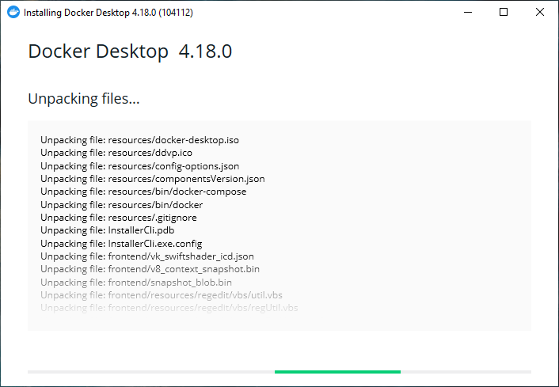  
*Docker Desktop Installation - 2*

## Windows Subsystem for Linux (WSL) Error

Upon first launching Docker Desktop you may receive the following error about the Windows Subsystem for Linux:

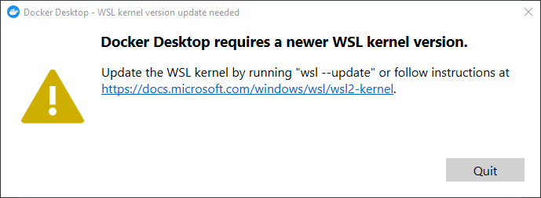 
*Docker - WSL Error*

To install the WSL system, open a `command prompt` and enter the command `wsl --update`. This will install or update your WSL installation, as required by Docker Desktop:

 
*Docker - WSL Update*

# About EF5
EF5 was created by the Hydrometeorology and Remote Sensing Laboratory at the University of Oklahoma. The goal of EF5 is to have a framework for distributed hydrologic modeling that is user friendly, adaptable, expandable, all while being suitable for large scale (e.g. continental scale) modeling of flash floods with rapid forecast updates. Currently EF5 incorporates 3 water balance models including the Sacramento Soil Moisture Accounting Model (SAC-SMA), Coupled Routing and Excess Storage (CREST), and hydrophobic (HP). These water balance models can be coupled with either linear reservoir or kinematic wave routing. 

## Learn More

EF5 has a homepage at [http://ef5.ou.edu](http://ef5.ou.edu). The training modules are found at [http://ef5.ou.edu/training/](http://ef5.ou.edu/training/) while the YouTube videos may be found at [https://www.youtube.com/channel/UCgoGJtdeqHgwoYIRhkgMwog](https://www.youtube.com/channel/UCgoGJtdeqHgwoYIRhkgMwog). The source code is found on GitHub at [https://github.com/HyDROSLab/EF5](https://github.com/HyDROSLab/EF5).

See [./docs/manual.html](./docs/manual.html) for the **EF5 operating manual** which describes configuration options.

## Contributors

The following people are acknowledged for their contributions to the creation of EF5.

- Zac Flamig
- Humberto Vergara
- Race Clark
- JJ Gourley
- Yang Hong
